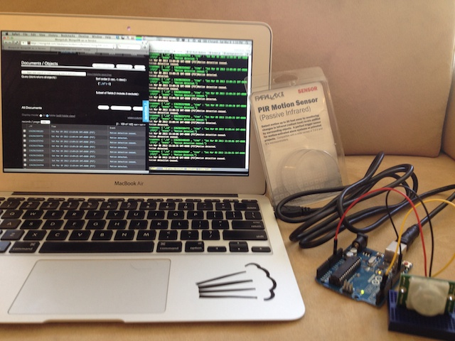

# mongolab-motion

An Arduino motion sensor example that logs to MongoLab's REST API and
to an email address.

This simple Node.js example sends Arduino sensor data to a MongoDB
database hosted at MongoLab.  It uses the MongoLab REST API.  It also
sends results based on rules to email.  

The hardware in the photo is an [Arduino UNO
R3](http://arduino.cc/en/uploads/Main/ArduinoUno_R3_Front.jpg) and a
[Parallax PIR motion
sensor](http://www.parallax.com/tabid/768/productid/83/default.aspx)
(the white dome in the lower right).

The motion sensor behaves like a switch, with 'down' events emitted on
motion detection, and 'up' events a few seconds after motion ceases
to be detected. 

MongoLab's REST API is used to record these motion detected and motion
ceased events with a timestamp.

The events can be emailed as well.  What events are emailed are
determined by two configurable callbacks with parameters of timestamp
and running count of events.  Two simple filters are provided,
including one that sends email only if the time of the event is
between 7pm and 8am.  The other sends email every 10th event.

# How To

Open the config-sample.js file and fill in your MongoLab REST API
credentials and mail (SMTP) config and credentials.  

You can view events in either the MongoLab API or through the mongo
shell, if you have that installed.  The screen on the left is the
MongoLab list view.

Tested against SendGrid's free SMTP endpoint.

With thanks to the Arduino community, esp. Rick Waldon for Johnny
Five, SendGrid for the Uno board, esp. @swiftalphaone for the Waza
tutorial, and the Node.js and Javascript community.

March 2013

### MIT License

Copyright (c) 2013 Benson Wen

Permission is hereby granted, free of charge, to any person obtaining
a copy of this software and associated documentation files (the
"Software"), to deal in the Software without restriction, including
without limitation the rights to use, copy, modify, merge, publish,
distribute, sublicense, and/or sell copies of the Software, and to
permit persons to whom the Software is furnished to do so, subject to
the following conditions: 

The above copyright notice and this permission notice shall be
included in all copies or substantial portions of the Software.

THE SOFTWARE IS PROVIDED "AS IS", WITHOUT WARRANTY OF ANY KIND,
EXPRESS OR IMPLIED, INCLUDING BUT NOT LIMITED TO THE WARRANTIES OF
MERCHANTABILITY, FITNESS FOR A PARTICULAR PURPOSE AND
NONINFRINGEMENT. IN NO EVENT SHALL THE AUTHORS OR COPYRIGHT HOLDERS BE
LIABLE FOR ANY CLAIM, DAMAGES OR OTHER LIABILITY, WHETHER IN AN ACTION
OF CONTRACT, TORT OR OTHERWISE, ARISING FROM, OUT OF OR IN CONNECTION
WITH THE SOFTWARE OR THE USE OR OTHER DEALINGS IN THE SOFTWARE.
